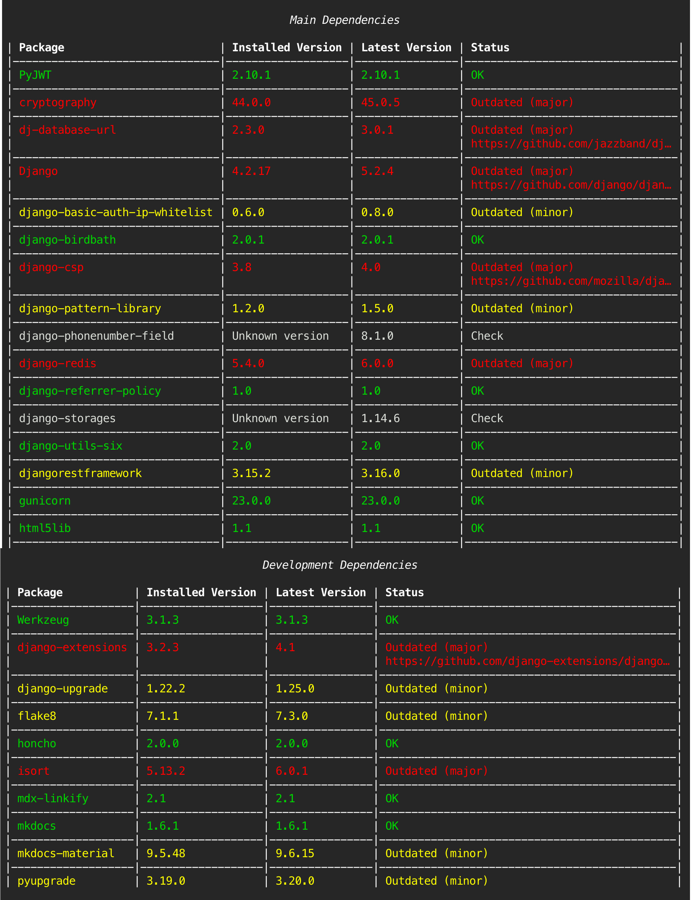

# Dependency Checker


A tool to report outdated dependencies in Python projects using Poetry.

## Table of Contents

- [Why use this tool?](#why-use-this-tool)
- [Requirements](#requirements)
- [Installation](#installation)
- [Usage](#usage)
- [Options](#options)
- [How it works](#how-it-works)
- [Limitations](#limitations)

## Why use this tool?

If you're using Poetry for Python dependency management, this tool helps you decide whether you need to update dependencies.

For example, your `pyproject.toml` file may have a version range specified, but it may not be clear if the version in the lock file is the latest allowed by your range in the `pyproject.toml` file.

You could run `poetry show [dependency]` to get the installed version, then check PyPI for the latest version. However, if you have many dependencies, this can be time-consuming—let this tool do it for you.

## Requirements

- Python 3.11+
- [UV](https://docs.astral.sh/uv/) - Python package manager

## Installation

1. Clone this repository:

   ```bash
   git clone https://github.com/nm-examples/dependency-checker.git
   cd dependency-checker
   ```

2. Create and activate a virtual environment (optional but recommended):

   ```bash
   uv venv
   source .venv/bin/activate
   ```

   This step isn't strictly necessary but is recommended to enable command completion for folder paths when checking local repositories.

## Usage

### Basic Commands

Without activating the virtual environment:

```bash
uv run check [-r] [local or remote]
```

With the virtual environment activated:

```bash
check [-r] [local or remote]
```

If you run the command without any arguments, it will display the help documentation.

### Workflow

1. Enter the URL for your remote repository or the path to your local repository
2. Choose the branch to checkout and run the report on
3. If multiple Dockerfiles are found, choose the one to inspect

## Options

| Option | Description |
|--------|-------------|
| `-r` | Output a printable report to a file (`report.html`). View with `open report.html` |
| `local` | Check a local repository (a folder relative to the directory this script is run from) |
| `remote` | Check a remote repository |

### Getting Help

Command help is available for all commands:

```bash
uv run check --help
uv run check remote --help
uv run check local --help
```

## How it works

The tool performs the following steps:

1. **Repository handling**:
   - Clones the repository and checks out the specified branch (for remote repositories)
   - Analyzes the local folder (for local repositories)

2. **Docker analysis**:
   - Finds and inspects the Dockerfile to identify the Docker image version and Poetry version used

3. **Dependency extraction**:
   - Builds a new image based on the Dockerfile
   - Exports the dependency list using `poetry export` to `requirements-frozen.txt`

4. **Version comparison**:
   - Compares each dependency version in `requirements-frozen.txt` with the latest version on PyPI
   - Only checks dependencies listed in the `pyproject.toml` file

5. **Reporting**:
   - Outputs results in the console indicating outdated dependencies and manual checks required
   - Optionally generates an HTML report file

### Example Console Output



## Limitations

- Only works if the Dockerfile uses Poetry to install dependencies
